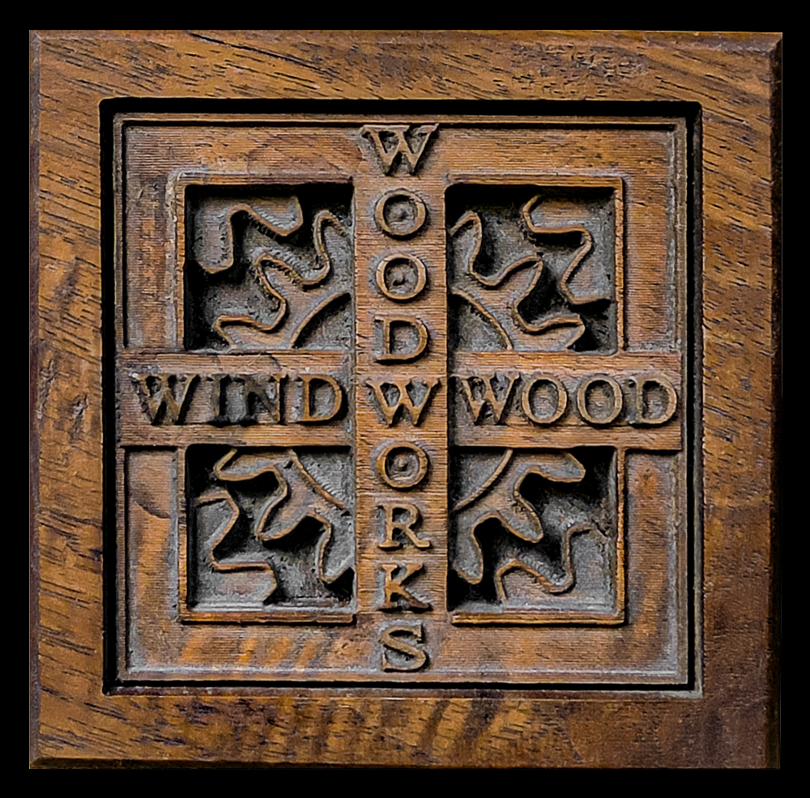

  

# Windwood Woodworking

Welcome to my workshop.  
I build custom furniture, fine woodworking pieces, and CNC‑carved designs that blend traditional craft with modern tools.

---

## 🪵 What I Make

- Furniture  
- Unique boxes  
- CNC relief carvings  
- Mirror frames and wall art  
- Bespoke woodwork  

---

## 🌲 Philosophy

Wood tells the truth.

Meaning arrives slowly, like dew settling on a morning surface.  
Notice the small pull and follow it without explanation.  
A felt direction is often truer than a planned route.

Listen for the quiet thread that asks to be followed.  
Form appears when attention softens and stays present.  
Resonance is a gentle alignment, not a loud proclamation.

Discovery happens in the space between looking and doing.  
Truth often arrives as a subtle confirmation, not a revelation.  
The world offers hints; we only need to be willing to receive them.

Presence shapes what unfolds, one quiet gesture at a time.

Every board has a story — grain, tension, scars, and surprises.  
My job is to listen, shape, and reveal what’s already there.

---

## 🛠 Current Projects

- Updating my CNC workflow  
- Designing a new line of small‑batch boxes  
- Photographing past builds for the gallery  

---

## 📬 Contact

More coming soon.
